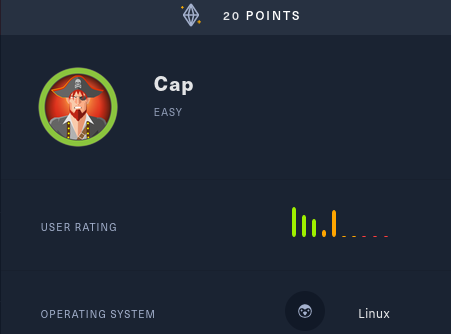
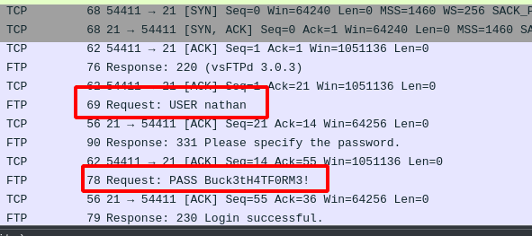
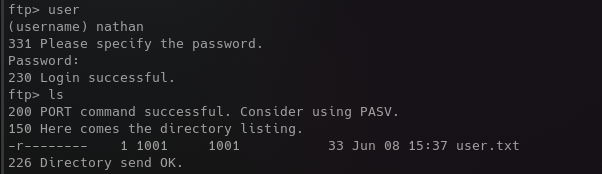
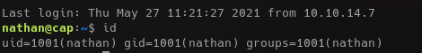
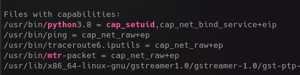
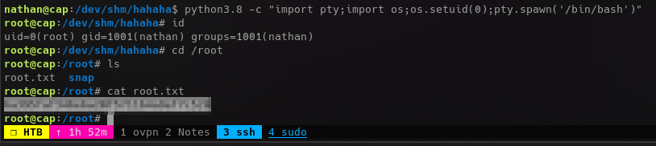

 

 

# Cap
Intro intro intro....

## Initial Recon
Initial foothold took a second... Dig around the site properly and you'll find a few pcaps, one of which contains the user credentials.

 

 

 

 

 

 

## The Linpeas Game
My methodology revolves entirely around linpeas.  While it runs, I will sit here in shame at my lack of manual privesc enumeration skills..........
 

This looks promising.
 

 

A little too easy...
 

 