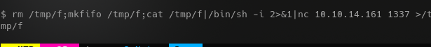
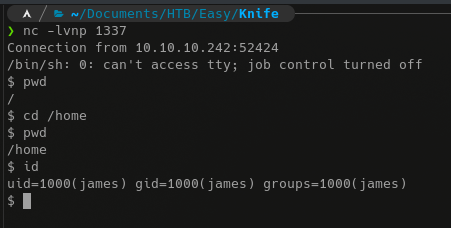
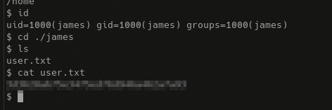
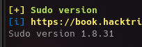
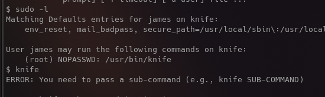
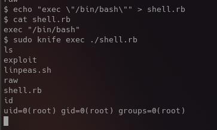

 

 

# Knife
Intro intro intro....

## Initial Recon
Google Zerodium.  I forgot to write this up while getting user, but that's all there is to it really.
 

 

 

 

 

 

## Privilege Escalation
Linpeas says......
 

 

This is exciting, I finally get to use that shiny "new" (not really anymore) sudo heap overflow.
 
[POC here](https://github.com/CptGibbon/CVE-2021-3156).
 

Okay, I should have known. It's patched :(
 

But I found this.  I'm always slightly over-thinking these easy boxes....
 

 

And we root bois!
 

 

Short and sweet!