#Laboratory
Definitely not an easy box for me.  Ready and Passage were both easier in my oppinion.  The Arbitrary File Read turned RCE was  alot of fun to read about and try out though. 

 
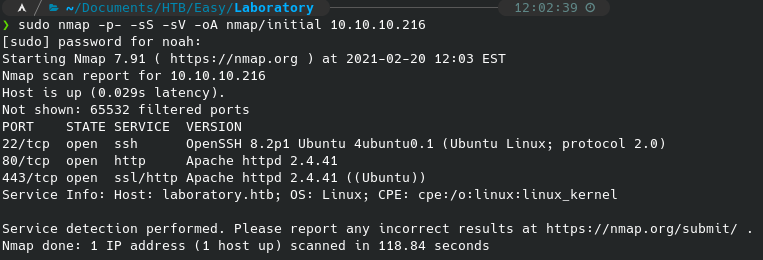
 
Initail recon is initial recon.

 
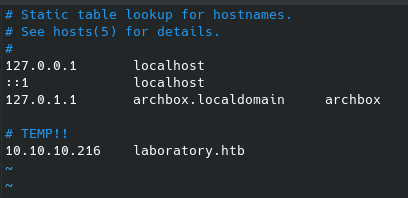
 
Navigating to the website, it's clear we have to add this to to /etc/hosts/.

 
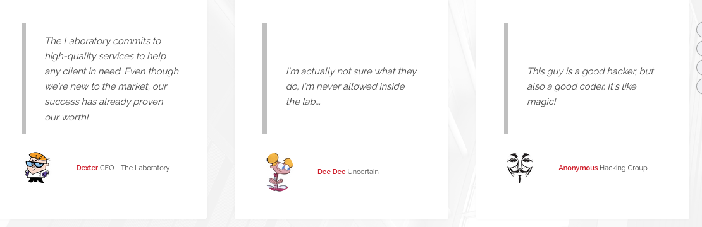
 
Potential user accounts on the box.

 

 
Looking at the SSL cert I noticed something interesting.  I realized this was the case when I tried gobustering the https version of the site.

 
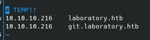
 
Added the virtual host domain to /etc/hosts.

 
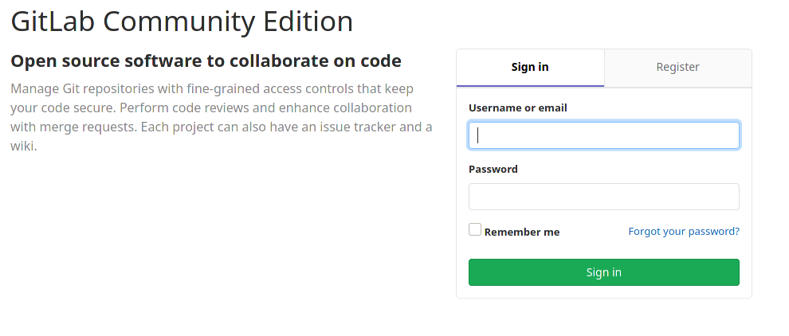
 
Okay.  Gitlab.

 
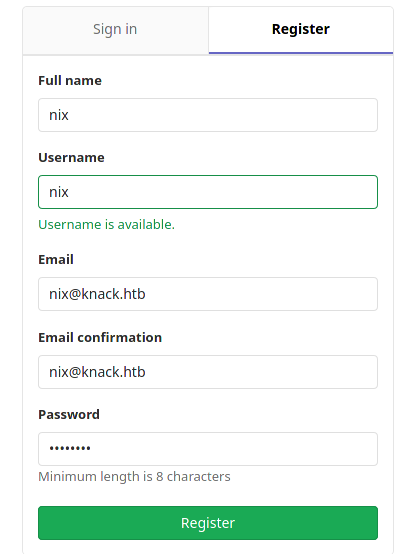
 
Let's register for an account.

 

 
Okay...

 
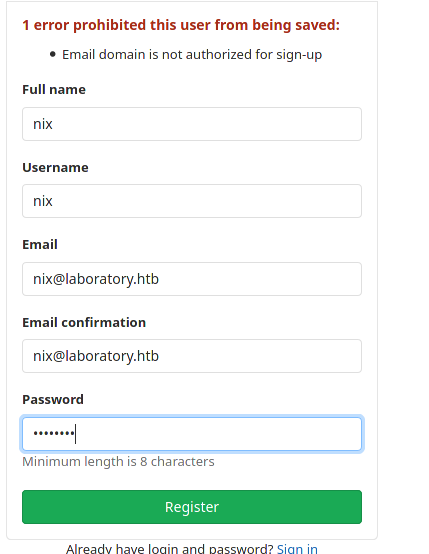
 
Okay that checks out.

 
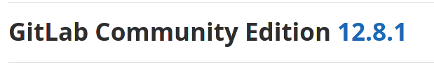
 
Gitlab version is 12.8.1.

 
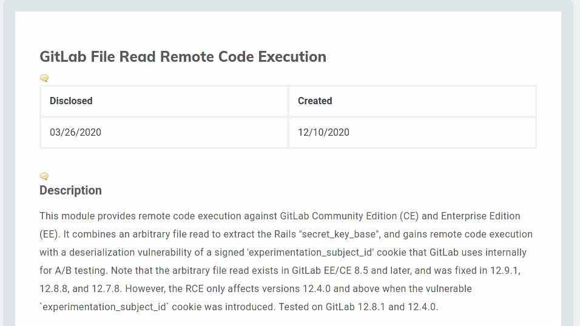
 
This looks like money.

 
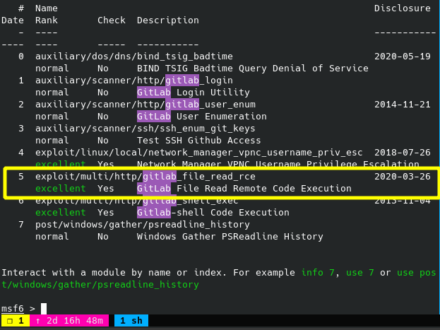
 
Heres the msf module.  Unfortunately the code that interacts with the gitlab API doesn't work, and I don't know ruby. :upside_down_face:

 
After some nudging on the HTB Discord, I managed to find the original HackerOne disclosure thread about this bug. It explains how to pull off the arbitrary file read, as well as how to turn that into an RCE.  [Here's the disclosure.](https://hackerone.com/reports/827052)

 
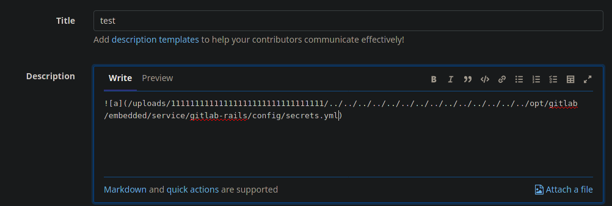
 
Here is the payload to read the secrets.yaml file needed for RCE.

 
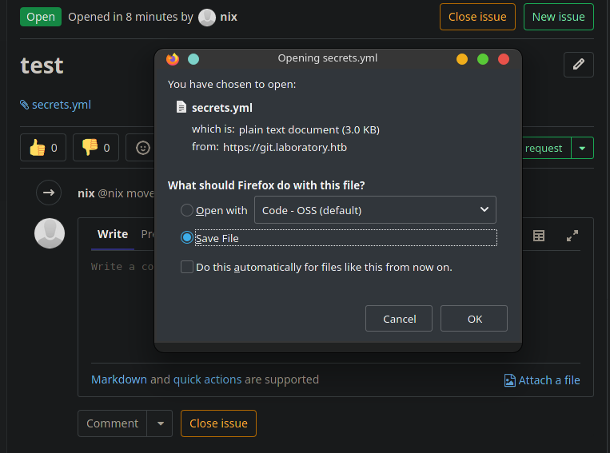
 
Once the issue is moved, we can download the file specified.

 
I forgot to grab a screenshot of the process, but the msf module from earlier managed to execute the RCE when I set the secret_key_base to that of the server.

 
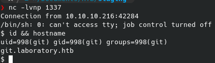
 
I grabed a proper tcp reverse shell because the msf payload one was giving me problems.  For some reason I could not change directories.  Either way a full TTY is easier to work in.  I'm sure there's a way to upgrade the reverse tcp msf payload but I am not a msf master quite yet.

 
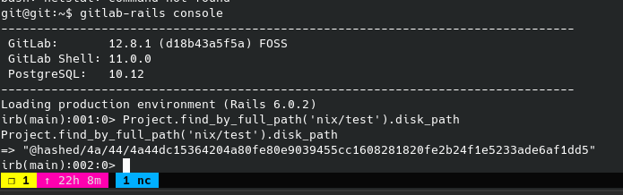
 
Reading up on gitlab documentation, I am starting to get a feel for how the user path is going to go.  Here, I am testing the functionality of this rails console command.  The default storage behavior of gitlab is to hash project storage locations, instead of just storing in human readable locations on disk.  I am hoping I can guess dexter's project name? Not sure yet.

 
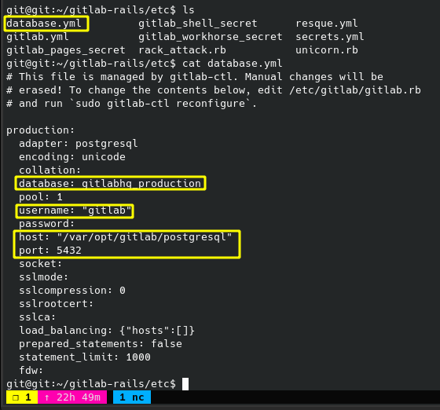
 
Gave up on the rails console for now and went back to standard enumeration. Found this interesting config file.

 
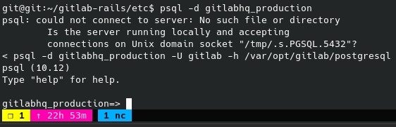
 
Alright this is progress.  This is NOT an easy machine IMO.

 
Doing a `\dt` on the databse shows some possibly usefull tables: members, project_repositories, projects, users.

 
Describing the users table with `\d users` shows these relevant collumns: id, username, encrypted_password, admin, 

 
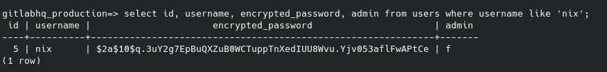
 
Okay so we can dump hashes.  Who knows if they're crackable yet.

 
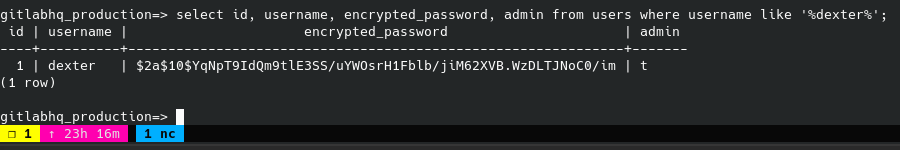
 
And here's dexters dump. Let's enum all users here just to see.  We still need user flag and root flag.

 
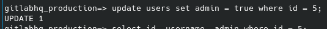
 
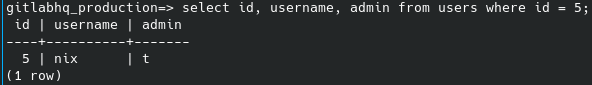
 
Let's see what I can do as an admin.

 
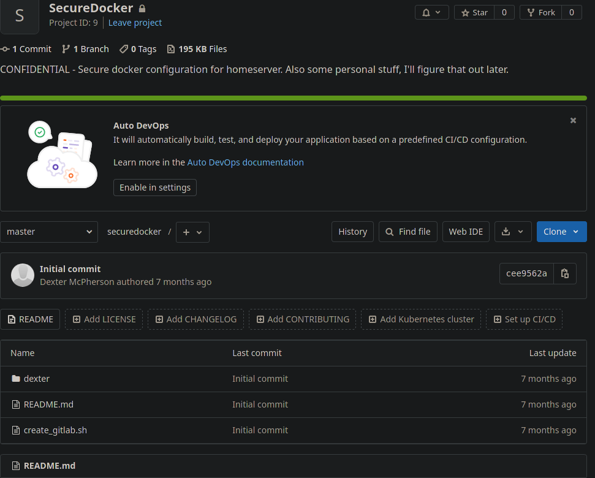
 
I had a strong feeling I was in a container...

 
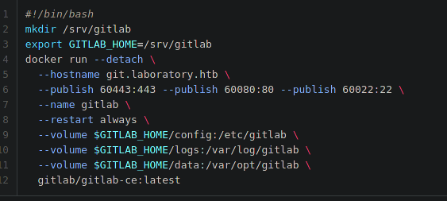
 
This is the shell script used to bring up the gitlab container.

 
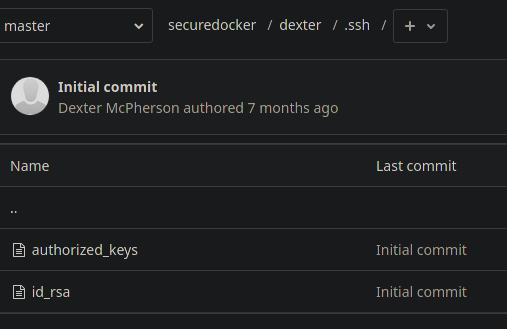
 
Inside the secure docker project is dexter's private ssh key!

 
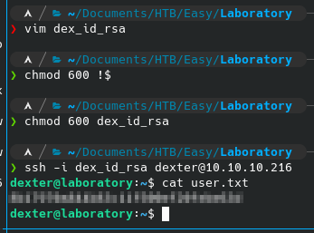
 
I'm super excited to finaly get user you have no idea! I have been working on this ALL day. :grin:

 
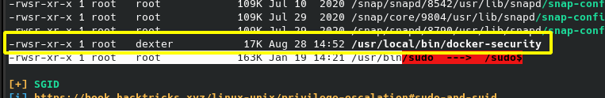
 
Okay I was stuck here for too long.  Missed this line in linpeas.  Need to just break down and get a proper find methedology.

 
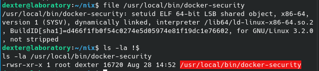
 
It's an ELF binary.  Strings is not installed on the machine.

 
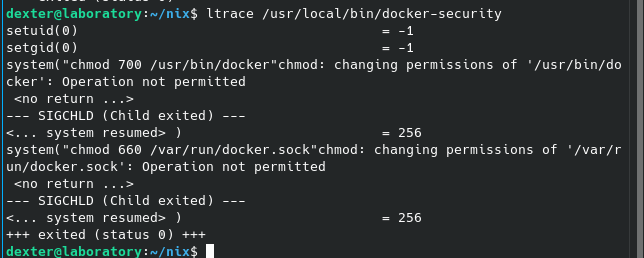
 
Dynamic analysis of the binary shows what it's doing.  Namely, it's calling chmod from a relative path.

 
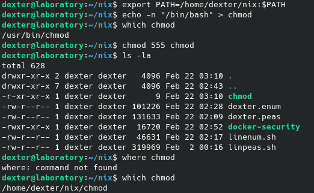
 
Standard stuff here.

 
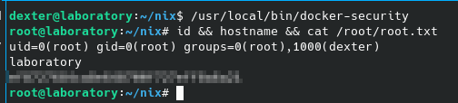
 
I am so happy to be done with this box forever...

