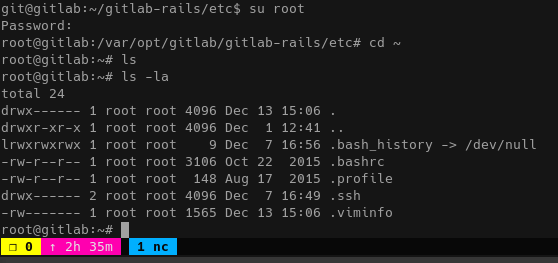

#Ready
This one was short and sweet, but definitely made me realize I have a lot to learn about docker and kernel capabilities.

 

 
Initail recon is initial recon.

 

 
I tried the original exploit, but had dependancy problems on my machine.  Spent 20 mins fixing them only to get indice out of bounds.  So this is a re-write of that same exploit.  Better luck?

 

 
Here's what it needs.

 

 
Succes?

 

 
Success!

 

 
This can be used to chown files as if we had id=0.  Not sure exactley how yet..

 

 
LinPEAS is a gift from god I swear.  I wish I caught this when I was doing Laboratory...

 

 
Okay I'm an admin.  This was a lot easier than manipulating the DB like I did a certain other gitlab machine... I'm sick of gitlab.

 

 
Nothing in the user's repo on first look over.  Here's an password though.  Thanks linpeas!

 

 
Okay that password got us "root".

 

 
Hence the quotations.

 

 
Reading up on comon docker escapes, I learned about the --privelaged flag used to start container instances with privelages to access the hard disk directly.

 

 
Unfortunately it's not going to be that easy!

 

 
Found a PoC on hacktricks that shows runs commands on the host.  Not sure the specifics of how it works unfortunately but I'm plannig on doing a deep dive on docker security at some point, probably on TryHackMe.
 

 
Here's the alterations I made to get the root ssh key.

 

 
Here's the root ssh key.

 

 
Done!
