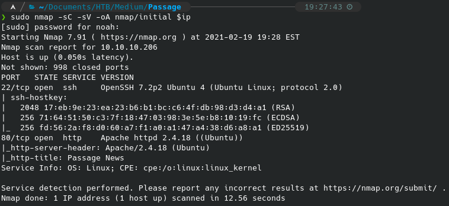

# Spectra
This is a ChromeOS box, which from my understanding is based on Gentoo.  I am going to regret doing this probably.  (Spoiler alert, I didn't!)

 

 
Initial nmap scan shows mysql, ssh, and nginx.

 

 
Wordpress?

 

 

 
This turns into a rabbit hole.  Password was not guessable.

 

 
Heres something interesting.

 

 
Viewing the source of that page shows the MySQL creds.

 

 
Well that looks like it isn't going to work.

 

 
Password reuse.

 

 
Admin access gets an easy shell upload.

 

 
Reading `/etc/passwd` shows us the user we will likely be trying to get.a[]

 

 
These are the real db creds for the live site.

 

 
We can succesfully get into the MySQL DB, but it's kinda shitty without a tty.

 

 
After spending a lot of time on nothing, I got hint from the discord to look in /opt

 

 

 
Not sure who that password is for, I mean it can't really be root right.

 

 
As expected, this is katie's password.  We can aslo see we are part of the developer group!

 

 
This is definitely something important for privesc.  I looked on the internet to learn more about wha these are.  Read [here](https://askubuntu.com/questions/5039/what-is-the-difference-between-etc-init-and-etc-init-d). 

 

 
So this is on of the original init files.  These are all owned by root.  So we should be able to edit them, and then (somehow) have them run as root? I found [this](http://upstart.ubuntu.com/getting-started.html) getting started guide on Upstart (the init system used in place of SysVinit).

 

 
That's convenient.  We're on the right track clearly.  I have noticed during this time that the test.conf file is getting overwritten periodically by what I'm guessing is a cron job.. Annoying.  

 

 
I had problems running this quick enough so I wrote it to katie's home dir so I wouldnt have to keep re writing the job config.

 

 
Here you can see that the test job starts and actuall does what I want it to this time.
