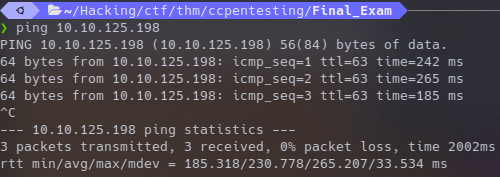

# Pentesting Crash Course
The [Pentesting Crash Course](https://tryhackme.com/room/ccpentesting) room on [Try Hack Me](https://tryhackme.com/) is a great place to start learning about common tools and methodologies used in penetration testing.  
 

This write up documents the process of rooting the "final exam" machine that is presented as the last task in the room.  
 

## ping
THM is different than HTB. Instead of one box geting constantly reset, THM boxes are spun up just for you!  This being the case, boxes can sometimes take a minute or two to come up.  We can monitor the upstate of the box with ping.  

