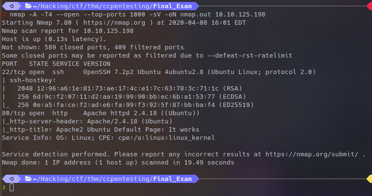
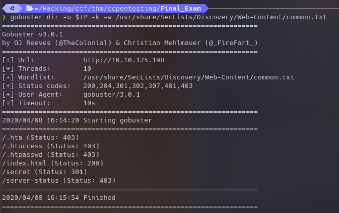
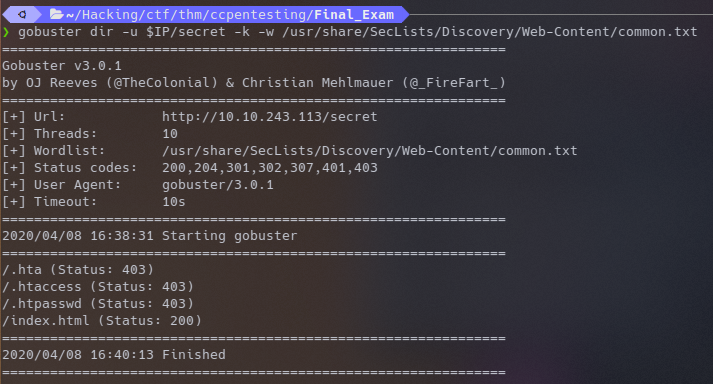
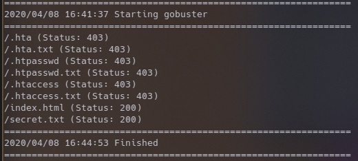
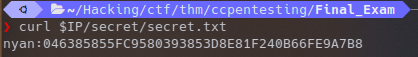
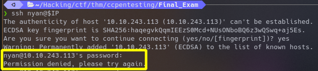
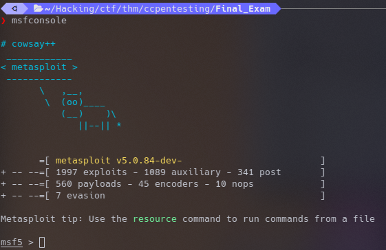

# Pentesting Crash Course
The [Pentesting Crash Course](https://tryhackme.com/room/ccpentesting) room on [Try Hack Me](https://tryhackme.com/) is a great place to start learning about common tools and methodologies used in penetration testing.  
<br/>

This write up documents the process of rooting the "final exam" machine that is presented as the last task in the room.  
<br/>

## ping
THM is different than HTB. Instead of one box geting constantly reset, THM boxes are spun up just for you!  This being the case, boxes can sometimes take a minute or two to come up.  We can monitor the upstate of the box with ping.  
<br/>

<br/>

## Enumeration
### nmap
```sh
nmap -A -T4 --open --top-ports 1000 -sV -oN nmap.out 10.10.125.198
```
<br/>

<br/>

<br/>
Looks like ssh and Apache.  We could try and brute force ssh with hydra, but this was not covered in the crash course.  What was covered was ~~dirbuster~~ gobuster.
<br/>

### GoBuster
<br/>

<br/>

<br/> GoBuster has shown us there is a `/secret` page we can visit, but when we navigate there in chrome it is an empty body. we can tell at the very least that secret is a directory, so lets gobuster it again.  
<br/>

<br/>

<br/> Hmm nothing, lets check for files with `.txt` extensions.
<br/>

<br/>

<br/> Read the contents of `secret.txt` with a browser or cURL, and use the credentials to connect to ssh.
<br/><br/>
<br/><br/>

###

### Metasploit
<br/>

<br/>