# OWASP Juice Shop
The [OWASP Juice Shop](https://tryhackme.com/room/juiceshop) room on [Try Hack Me](https://tryhackme.com/) is a good room to practice basic web app exploits.  Also take a look at the [Learn Burp Suite](https://tryhackme.com/room/learnburp) room if your a total beginner at web app pentesting (like myself when completing this room!)
<br/>

Before we start working through the hands on tasks, take a look at the scoreboard located at [roomIP]/#/score-board.
<br/>

## Task 4 - Injection
The first challenge presented to us is leveraging a SQL injection to log in as the admin user. The first step in manual SQLi is trying to break it.
<br/>

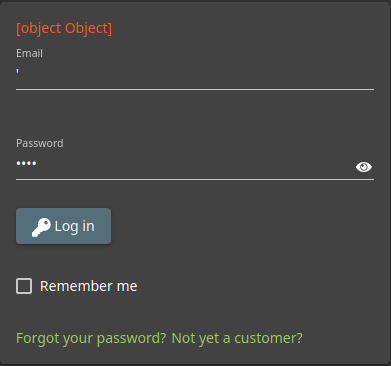
<br/>

While this doesn't get us logged in, it shows that that we can break, and therefore manipulate, the sql query. We also solve the challenge *Error Handling: (Provoke an error that is not very gracefully handled.)*
<br/>

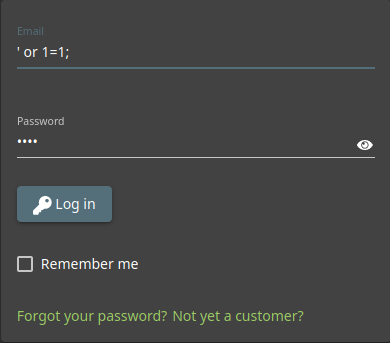
<br/>

This is a very basic SQLi, that will get us logged in as the admin user. Password here can be anything.
<br/>

## Task 5 - Broken Authentication
1. Reset Jim's password using the forgotten password mechanism - what was the answer to the secret question?
<br/>

Looking at our admin account, we see the email syntax is *user@juice-sh.op*.  If we log out of admin and go to the forgot password page, the email *jim@juice-sh.op* let's us see the security question for Jims account.
<br/>

```
Your eldest siblings middlename?
```
<br/>

Actually deciphering the answer to this question is trickey and requires searching through the applications for hints left by Jim.

I managed to log in as Jim with a SQLi:
```
jim@juice-sh.op' /*
```
However I had to look up the answer to the security question. (I have never seen Star Trek)
<br/>

2. What is the administrator password?
<br/>

For this question, it is probably easier to guess until you get it, or use a a very basic wordlist with burp intruder.  However, I am an idiot and couldn't guess it, and intruder as **super** limited unless you have a license for the pro version of burp. (Note to learn ZAP)
<br/>

While mucking around on the site, you will notice rest api calls being made.  One such endpoint is
```
http://10.10.118.46/rest/product/search?q=test
```
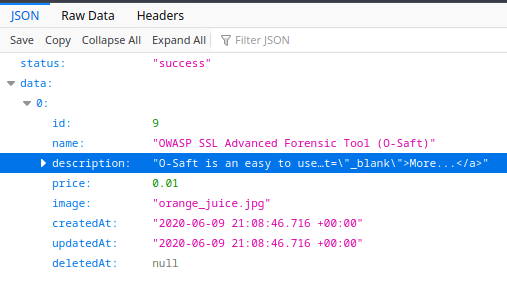
<br/>

You can perform a sqli here with the syntax
<br/>

**http://10.10.118.46/rest/product/search?q=test')) union select * from users;--**
<br/>

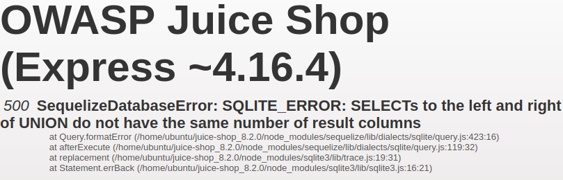
<br/>

We can see from normal use of the endpoint that the returned table has 8 collumns ('id', 'name', 'description', 'price', 'image', 'createdAt', 'updatedAt', 'deletedAt')
<br/>

**http://10.10.118.46/rest/product/search?q=test')) union select 'id', 'name', 'description', 'price', 'image', 'createdAt', 'updatedAt', 'deletedAt--**
<br/>

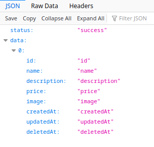
<br/>

From here we can dump whatever we want from the database presuming we know the table and collumn names.  From the previous test, we at least know that the users table exists.
<br/>

**http://10.10.118.46/rest/product/search?q=test')) union select 'id', 'name', 'description', 'price', 'image', id, email, password from users--**<br/>

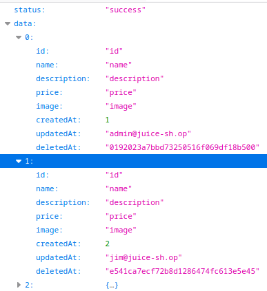
<br/>

So our admin password hash is:
```
0192023a7bbd73250516f069df18b500
```
See below for the wordlist used if your having trouble cracking it. (or try crackstation)
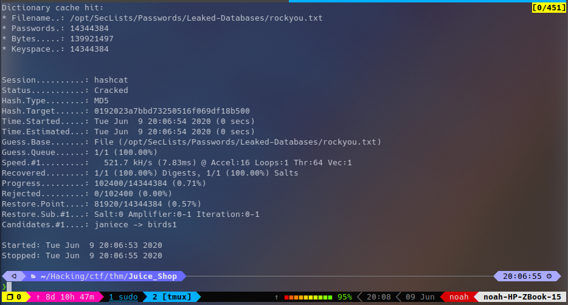
<br/>

## BONUS

Seeing MD5 (unsalted!) for password hashing is strange.  If you look on the scoreboard you can find a challenge called wierd crypto that refferences notifying the site admins of this security flaw. 
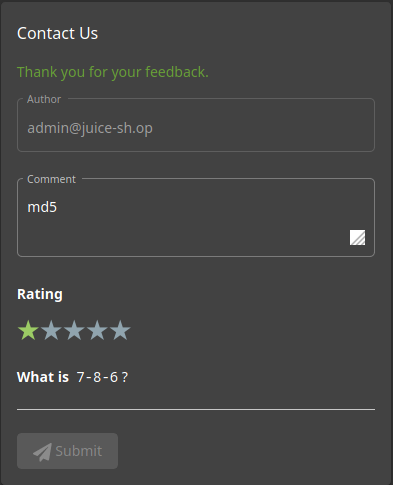
<br/>

We can also complete the Devestating Review challenge by giving them a zero start review in this same comment submission.  Just intercept with burp and alter the rating to be 0.
<br/>

## Task 6 - Sensitive Data Exposure
1. 	
Access a confidential document and enter the name of the first file with the extension ".md"
<br/>

If you make an order on the site, the order confirmation is shown in your browser as a pdf.  It is being served from a /ftp/ directory.  We can navigate here and discover local files stored on the server in this directory.

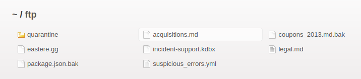
<br/>

## Task 7 - Broken Access Control
1. Access the administration section of the store - What is the name of the page?
<br/>

Like the hint says, search the js code for "Admin".

2. Access someone else's basket    
<br/>

Change the basket id (in session storage) using developer tools.
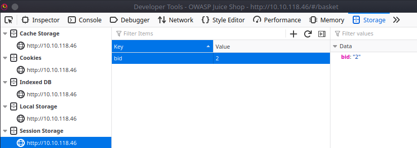
<br/>

3. 	Get rid of all 5 star customer feedback
<br/>

Use the admin page from question 1.  The admin gave his own site a 5-star review, delete to complete the challenge.
<br/>

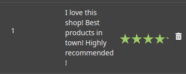
<br/>

## Task 8 - Cross Site Scripting (XSS)
1. Carry out reflected XSS using Tracking Orders.
<br/>

Payload is
```
<iframe src="javascript:alert(`xss`)">
```
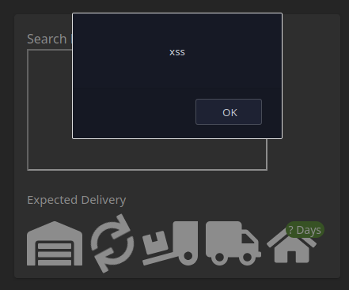
<br/>

2. Carry out XSS using the Search field?
<br/>

The same exact method can be used in the search field to perform reflected xss.