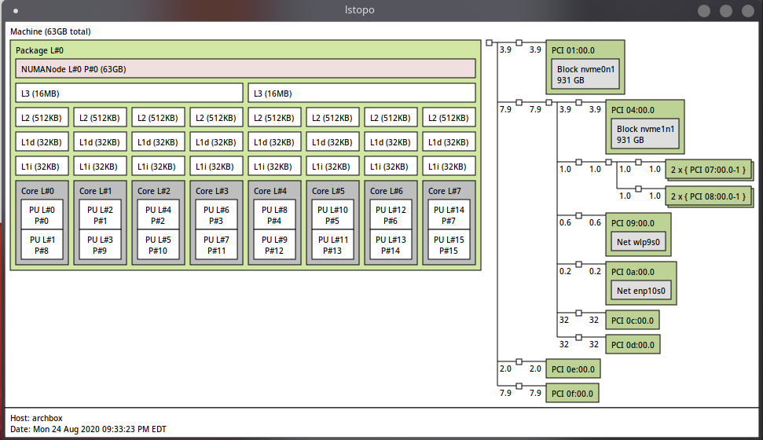

If you can't tell, I have spent loads more time tweaking and configuring my Windows gaming VM than actually using it to play games.  I fired up the VM today intending to test some Steam games and noticed the performance was severely lacking.  This post will walk through my steps to maximize performance in the VM while hopefully leaving enough resources for a smooth desktop experience in the host.  Just like with the initial set-up, I'll be using [the Arch wiki](https://wiki.archlinux.org/index.php/PCI_passthrough_via_OVMF#CPU_pinning).

# vCPU Pinning
Use ``lstopo`` or ``lscpu -e`` to see the topology of your CPU.
<br/>

<br/>

```
CPU NODE SOCKET CORE L1d:L1i:L2:L3 ONLINE    MAXMHZ    MINMHZ
  0    0      0    0 0:0:0:0          yes 3600.0000 2200.0000
  1    0      0    1 1:1:1:0          yes 3600.0000 2200.0000
  2    0      0    2 2:2:2:0          yes 3600.0000 2200.0000
  3    0      0    3 3:3:3:0          yes 3600.0000 2200.0000
  4    0      0    4 4:4:4:1          yes 3600.0000 2200.0000
  5    0      0    5 5:5:5:1          yes 3600.0000 2200.0000
  6    0      0    6 6:6:6:1          yes 3600.0000 2200.0000
  7    0      0    7 7:7:7:1          yes 3600.0000 2200.0000
  8    0      0    0 0:0:0:0          yes 3600.0000 2200.0000
  9    0      0    1 1:1:1:0          yes 3600.0000 2200.0000
 10    0      0    2 2:2:2:0          yes 3600.0000 2200.0000
 11    0      0    3 3:3:3:0          yes 3600.0000 2200.0000
 12    0      0    4 4:4:4:1          yes 3600.0000 2200.0000
 13    0      0    5 5:5:5:1          yes 3600.0000 2200.0000
 14    0      0    6 6:6:6:1          yes 3600.0000 2200.0000
 15    0      0    7 7:7:7:1          yes 3600.0000 2200.0000
```

Heres the xml I added to pin the vCPUs to the last 4 physical CPUs and set the VM topology.
```xml
<cputune>
    <vcpupin vcpu="0" cpuset="4"/>
    <vcpupin vcpu="1" cpuset="12"/>
    <vcpupin vcpu="2" cpuset="5"/>
    <vcpupin vcpu="3" cpuset="13"/>
    <vcpupin vcpu="4" cpuset="6"/>
    <vcpupin vcpu="5" cpuset="14"/>
    <vcpupin vcpu="6" cpuset="7"/>
    <vcpupin vcpu="7" cpuset="15"/>
    <emulatorpin cpuset="0,6"/>
  </cputune>

...

<topology sockets="1" dies="1" cores="4" threads="2"/>
```

# Audio lag and stutter
If, like me, you have issues with audio lag, desync, and stutter, you can fix it with the following changes to the audio device args (of course found on the Arch wiki...)
```xml
	<qemu:arg value="-device"/>
    <qemu:arg value="usb-audio,audiodev=usb,multi=on"/>
    <qemu:arg value="-audiodev"/>
    <qemu:arg value="pa,id=usb,server=/run/user/1000/pulse/native,out.mixing-engine=off"/>
```
This enables USB3 for 5.1 channel audio


# Dynamic core isolation
At this point we have near native gaming performance (CPU wise), but you still might see a rare hiccup if there is some sudden CPU usage on the host.