# Archetype

Recon the machine.  Notice RPC and ms-sql.
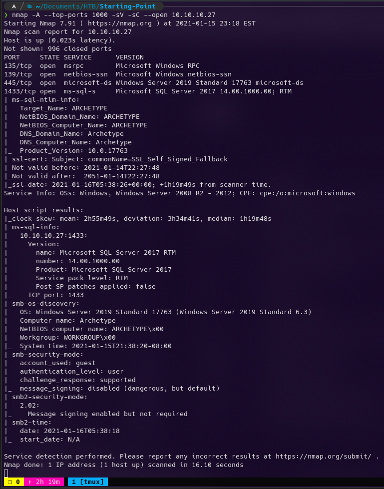

Use smbclient to enumerate network shares.
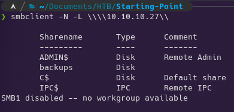

Try and connect to the backups share anonymously.
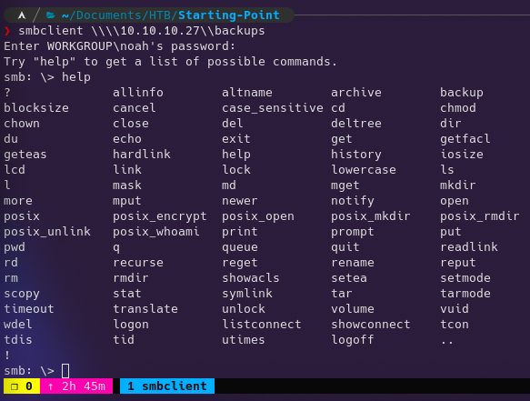

Connected successfully without a password.  Here is the help for smbclient.
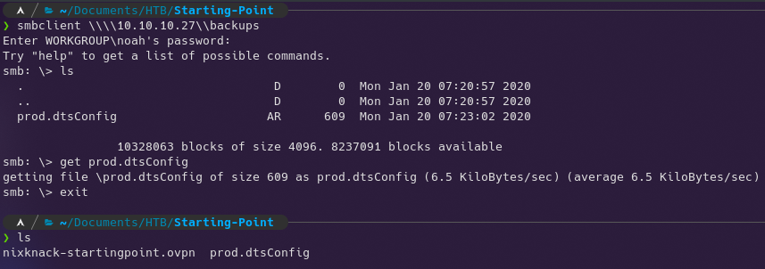

Grab the only file in the share.  .dtsconfig files are used to apply propertiy values to services that integrate with sql servers.  We can see the username and password used to authenticate to the sql server.
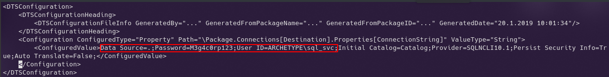

We will use mssqlclioent.py from Impacket to authenticate to the server.
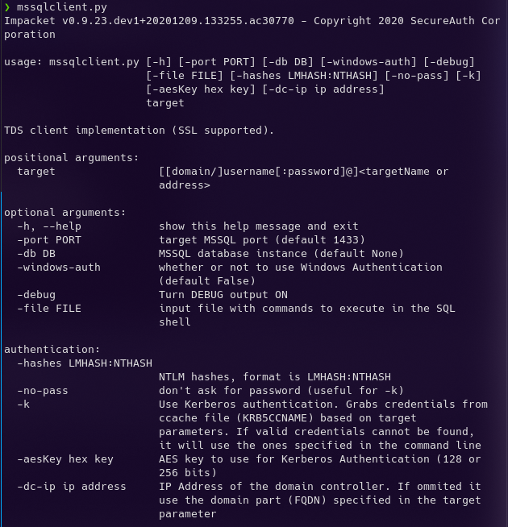

Here are the sql server credentials again, in an easier to work with format.
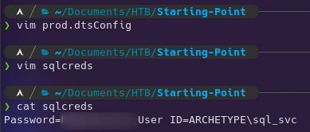

Authenticate to the server and get a SQL prompt.
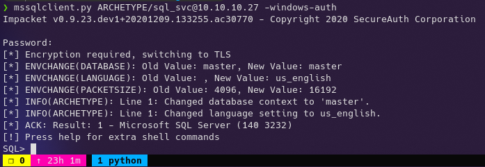

Here are mssqlclient.py specific commands. These help automate command execution.
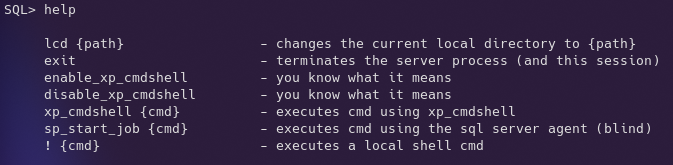

Opening firewall for reverse shell.
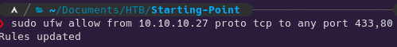

Opened two new tmux panes; The top is for a webserver to host the reverse shell download and the bottom is the netcat listener to catch the shell.
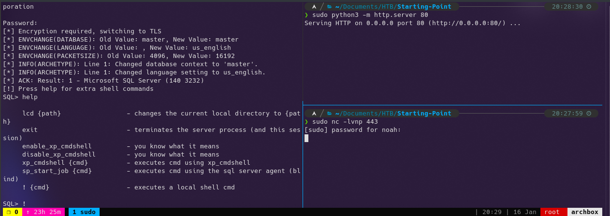

Used the sql server rce to download the reverse shell and received the connection in the nc listener.
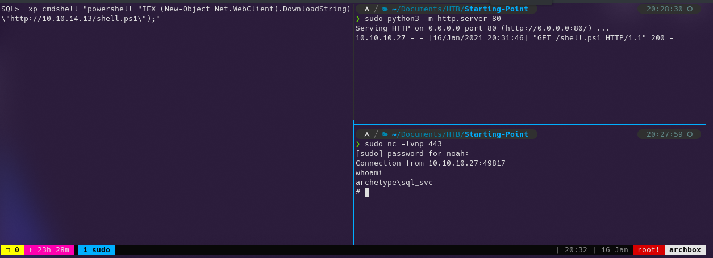

The flag of the sql_svc user.
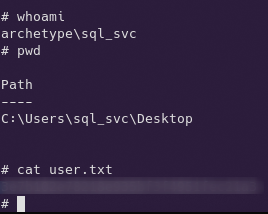

Look at the powershell history for that user.  We see admin creds.

Use psexec.py from Impacket to login to an interactive powershell console as administrator.
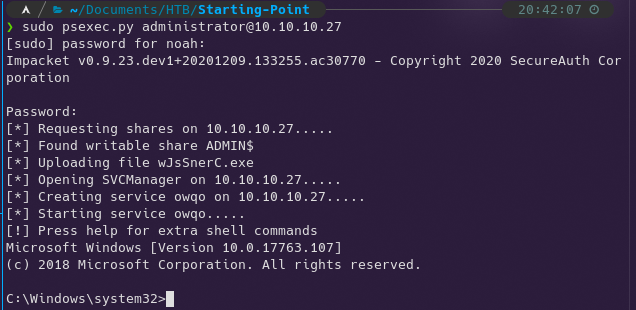

The root flag.
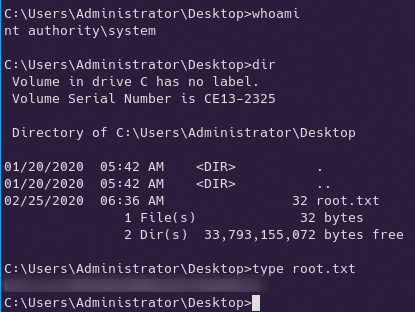