# Oopsie
This box was a lot of fun to do because of how easy it was, and linux machines are just easier to wrap my brain in general.  There is a real sense of accomplishment from rooting a box without being hand-held through it.  I will concede that I looked at the walkthrough once because I didn't think to reuse passwords from the first box.  I also really enjoyed the web-app part of the challenge despite fumbling around the login page for way to long.  Enjoy this thorough walkthrough!

Initial recon.
 
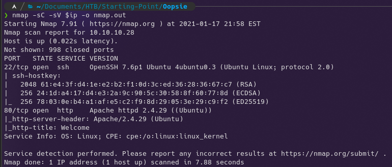
 

Gobusted.  Everything is forbidden...
 
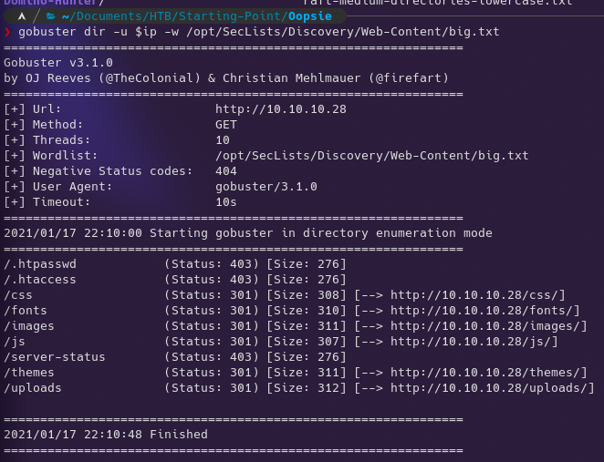
 

Zap spider didn't come up with much other than /cdn-cgi/login/script.js, but as you can see below it is an empty file.
 

 

Manually trying things that exepctedly don't work.
 

 

This is an interesting find which is a great example of why you need to understand what your tools do and mannually check things.  Burp and Zap spidering only follow links.  Obviously the empty script.js file in this directory was called in the index as a clue as to where the login page would be, but there are no direct links to this page anywhere on the main page.
 

 

I really like Zap because of the HUD integration in the browser. It allows you to intercept and modify requests without leaving the browser.
 
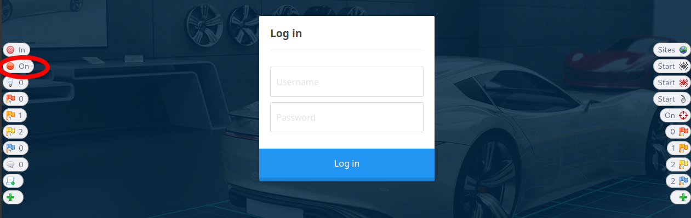
 

This will most likely not work...
 
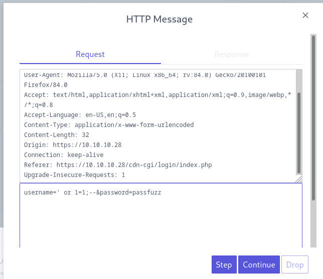
 

At this point I broke down and looked at the walkthrough just for this step and.... it's a reused cred from Archetype.  I guess thats a thing we do here.  Megacorp refferences on this site I guess so I should have made the connection.
 

 

Just poking around.  This looks like I can enumerate all user accounts.
 

 

This is also interesting. Super admin rights?
 
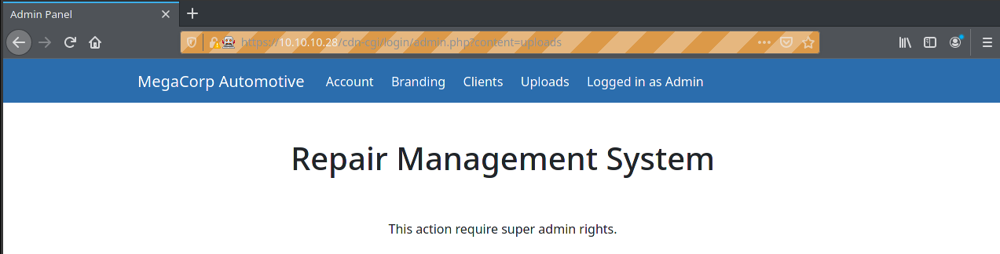
 

Preparing to fuzz user accounts. I tried manual incrementing and realized id's are not sequential. Or maybe there are no other users? Doubtfull.  I want to find this supposed super admin.
 
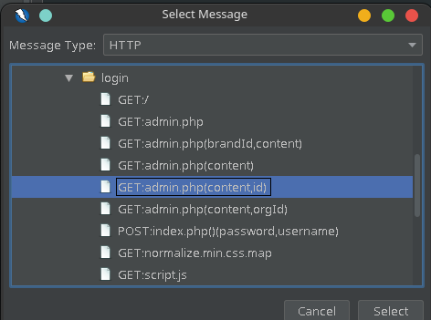
 

Careless fuzzing.  This could take way to long...
 
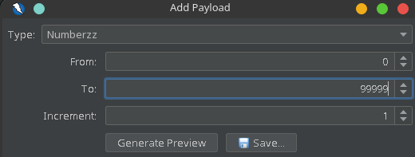
 

 
I stopped fuzzing at around 4%...
 

Sorting the fuzzed responses by size to get the user id's.
 

 

 
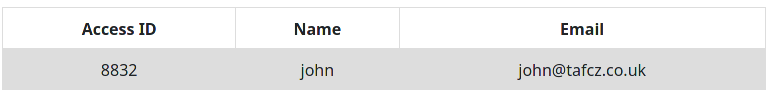
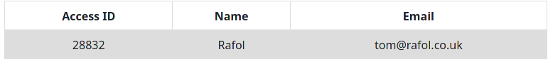
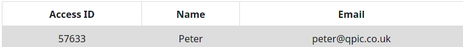

 

So from here I know from previous request editing that there is a cookie used by this site that takes this access ID as a parameter.  Let me pull it up in dev tools.
 

 

Now I'll try what I should have tried before fuzzing users.
 
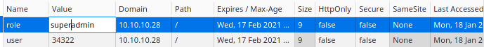
 

No dice.
 
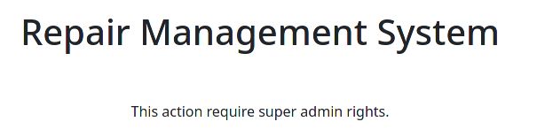
 

Trying the super admin access ID found from fuzzing.
 

 

Looks like it worked!  A shell is close from this point.  Let's test the upload to see if it cares about extension.
 
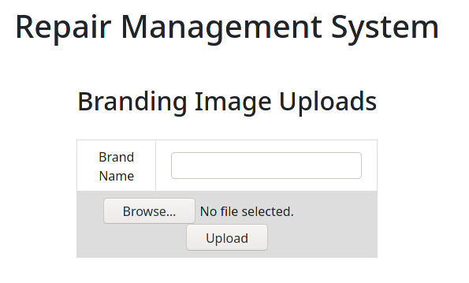
 

This is what we will try first. (I fixed the error in this after realizing my mistake.)
 

 

Ruh Roh scoobs.
 

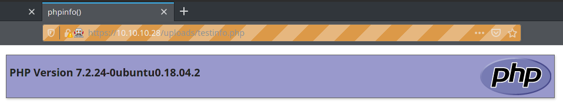
 

Grabbing pentestmonkey's quintessential php reverse shell and geting ready to catch the shell.
 

 

Catch the shell.
 

 

Prop up a webserver to host linpeas and grab it from the reverse shell.
 

 

I am officially tired of having a garbage reverse shell.  I don't remember where I pinched this from but this is a quick way to upgrade your shell.
 

 

Run it.
 
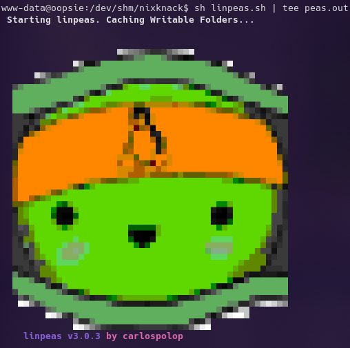
 

We already know this, but it's an interesting find by linpeas regardless.
 
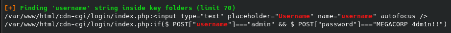
 

Heres the user flag.  I'm still thinking how to privesc to root.
 

 

This is a potential thing to look into.
 
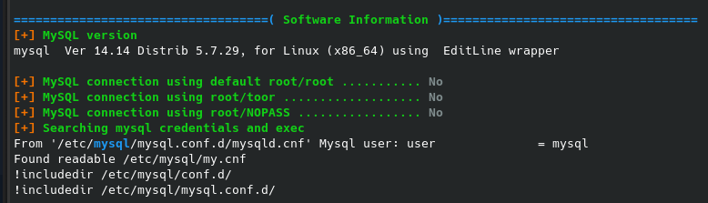
 

And I think I know the robert -> root privesc path
 

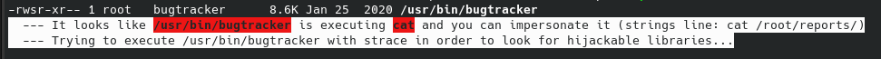
 

I am bashing my head against the wall on this one, but I will not check the walkthrough for at least another 45 minutes...
 

 

So I was thinking about that MySQL database. Obviously I couldn't log in to it, but it has to be used for the website.  So I went to take a peek around the apache site and hit user-pwn gold.
 

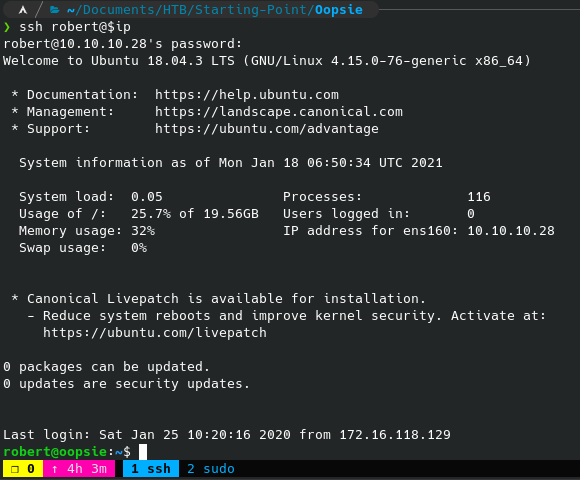
 

Now to try and execute that root privesc that linpeas informed us about earlier.  There's a lot to see here and I explain it below.
 
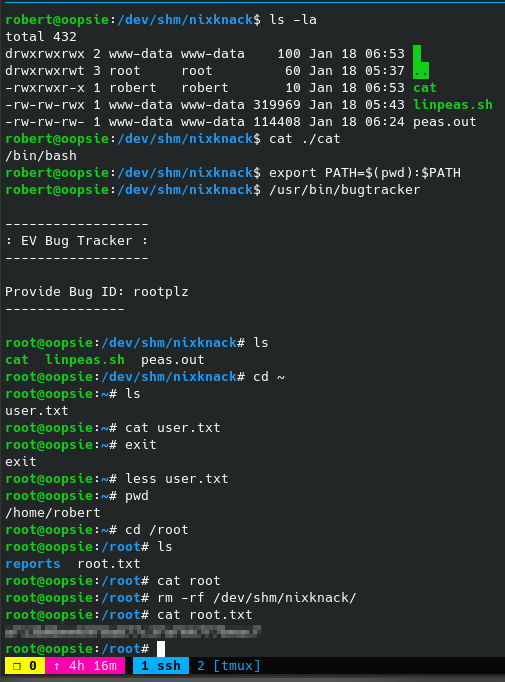
 

So basically linpeas told us that /usr/bin/bugtracker was calling cat with a relative path instead of an absolute one.  What this means is that we can write our own "cat" and essentially hijack the execution of that program.  This is usefull for privesc because the binary is owned by root and has the SUID bit set, meaning it executes as root when other users who are not root run it.  By adding our staging directory, where our custom cat command is, to the front of PATH, we essentially hijack all calls to cat that do not use a relative path.
 

I then proceed to troll myself by trying to cat the root flag.  It only works when I delete that malicious cat file.

## Thanks for reading!!!
