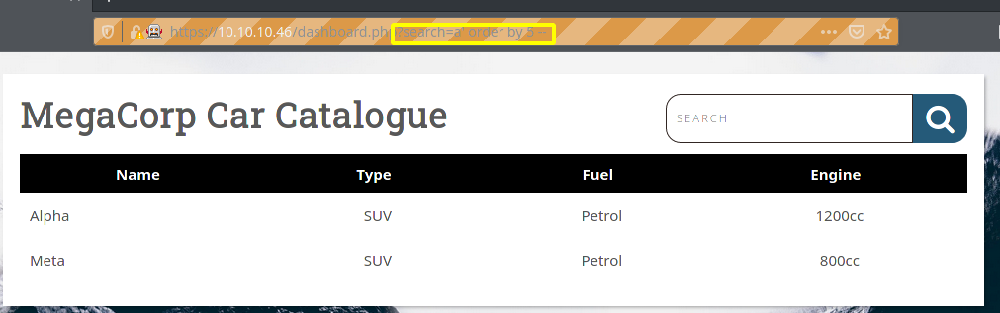

# Vaccine

This box was AWESOME! The SQL command execution and reverse shell stuff was a lot of fun to mess around with and I finally felt like all those hundred page long Database assignments I did last year were worth it.  I also didn't look at the walk-through once, accept in the begging for something stupid.
 

 

 
Initial recon shows FTP and ssh open, as well as a web-server running on port 80
 

 
Right of the bat I hit a hard roadblock.  The website points to a login page, where none of the previous credentials work.  Gobuster did not return anything of value using the Big.txt from SecLists.  And to top it off, I tried all the old creds on both the ssh and FTP servers which did not work either.
 

 
At this point I break down and peak at the walk-through to see how to even start this box, and wouldn't you know it, they pulled FTP creds for this box from the last box, which were in plain-text in root's home folder.  Frustrating to say the least, because I am used to just grabbing flags and going on my way.
 

 

 
Here is the final bit from the Oopsie walk-through where they mention the ftp creds.
 

 

 
Grabbing the backup.zip file from the FTP server.
 

 

 
The archive is password protected.  Should be fun.
 

 
Unfortunately the mirrors are down for a particular dependency needed to install JTR from the Arch repository, so I grab the source from Github and wait for it to build.
 

 

 
With jumbo john compiled we can use the zip2john utility to generate a hash from backup.zip that JTR will hopefully be able to crack.
 

 

 
Cracked quickly with an abridged `rockyou.txt`.
 

 

 
Successfully un-archiving the encrypted zip file with the cracked password.
 

 

 
Inside the backups folder is an index.php file with the password hash.
 

 

 
Cracked the hash with crack station to get the password.
 

 

 
The page is a catalog search function, we may be able to do SQL injection.  Notice the URL.
 

 

 
Before I mess around with the injection, I want to run gobuster again with the session ID cookie now that we are authenticated. Unfortunately that did not bring up anything new.
 

 

 
Baby's first SQLi works, so this should be straightforward given the proper amount of googling. My idea from here is to fingerprint the DBMS, then upload a reverse shell and call it from the sqli.  Let's see how that goes.
 

 

 
Using order by commands in the injection we can easily determine the number of collumns in the table.  Although visually it looks like 4, there is likely an ID column that is not being shown.  This is why we did the column enum first.
 

 

 
This confirms that the first column is an integer.
 

 

 
Now we can start doing fingerprinting.
 

 

 
I will try this first, since we confirmed we have the ID column that is an integer, and this seems quick and easy.  Source is [sqlinjection.net](https://www.sqlinjection.net/database-fingerprinting/)
 

 

 
POW(1,1) worked... I don't have a good feeling about it since it was the first thing I tried, that just seems too easy.
 

 

 
Well I guess I was right and wrong at the same time.  I was running with the assumption this was MySQL, which apparently shares function naming conventions with postgres.  Either way, fingerprinting is done and we can see if we can get command execution and possibly a reverse shell. 

 

 
I followed a guide for Postgres command execution [here](https://medium.com/greenwolf-security/authenticated-arbitrary-command-execution-on-postgresql-9-3-latest-cd18945914d5)
 

 

 
id command wasn't getting run for some reason so I'll try whoami to test the exec.  The fact that no errors returned means the command was executed.  I can't see the output unfortunatley because I could not get the COPY FROM PROGRAM commands working with a table that matched the cars table. In other words, I cannot union the cmd_exec table to see the results, so I will have to put a reverse shell on the box, and then call it from this injection, and use any sql errors returned instead of actual standard out to try and debug.
 

 

 
I used the command execution to call wget and grab a reverse shell python script from my machine.
 

 

 
I tried a few different ways, but eventually I got a reverse shell by uploading a pure python script and calling python3 from the injection.
 
d
 
My reverse shell kept getting killed, I assume there is a script that kills it after a certain period of time so the site doesn't lock up forever.  In the short time I had the shell, I managed to exfil some files from the web-server using netcat.  I didn't get captures of this because of how fast the connection was killed between tries.
 

 

 
Looking at the dashboard.php file I grabbed from the web server, we see the Postgres user creds that the web-server is using to connect to the database.
 

 

 
Here is the SQL code we injected into.
Now I don't know php at all, but it looks like this is what is causing our reverse shell to timeout.  I would guess that the COPY FROM PROGRAM throws an error if it hangs to long.
 

 

 
Surprisingly we can just ssh in as the Postgres user.  I then uploaded linpeas using netcat and ran it, teeing the output to peas.out.
 

 

 
Looks like we do not need to own Simon quite yet.
 

 

 
This is also interesting.  I do not know what the first file is there but it seems like something that should be followed up on.
 

 

 
This actually doesn't look useful for privesc. Let's just do basic stuff like check sudo and what is in that Simon users directory.
 

 

 
Well I over-thought this... Linpeas was not at all necessary. Note for future self to look at the basics first.
 

 

 
I didn't get to grab a capture of vim, but what you can do is `:!bash` to get a shell from vim.  Because we are running vim from sudo, we get a root shell!
 

## THANKS FOR READING! GO ROOT SOMETHING!