 
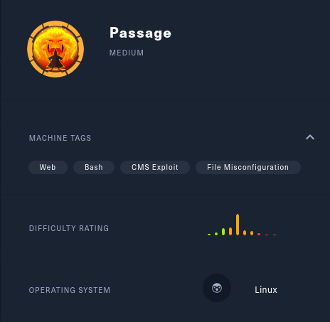
 
#Passage
This is the first Medium, and the most "realistic", box that I've done.  The foothold and user privesc were pretty straightforward, but the privesc to root was VERY cool!  It involves taking advantage of an insecure d-bus interface (the one used by USBCreator on Ubuntu).  In the version of Ubuntu present on this box, any member of the sudo group can launch USBCreator and take advantage of this vulnerability.  This has since been patched, and now password authentication is required to run USBCreator.

 

Read more about the USBCreator privilege escalation [here](https://unit42.paloaltonetworks.com/usbcreator-d-bus-privilege-escalation-in-ubuntu-desktop/)

 

 
Initial nmap scan shows OpenSSH and Apache on the expected ports.

 
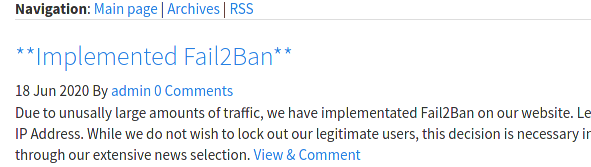
 
I got temporarily IP blacklisted while using gobuster to brute-force directories.  Looking at the page it is easy to see what happened.

 
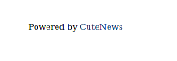
 
On the same page, I noticed this vital piece of info.

 
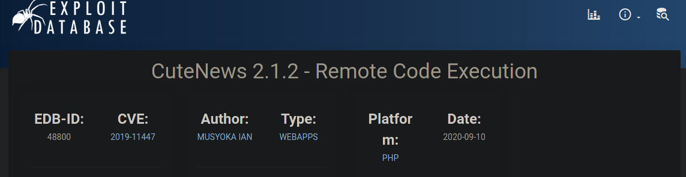
 
A quick Google brings me to this exploit.  I don't know the version running, but if you look at the code of the exploit you'll see the login panel address is http://IP/CuteNews.

 
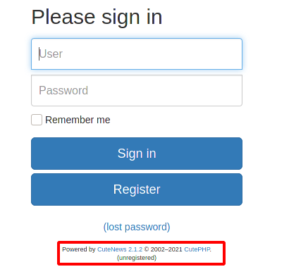
 
Awesome, so we should be able to use that exact exploit for remote code execution.  The code looks like it also dumps hashes, let's try it.  

 
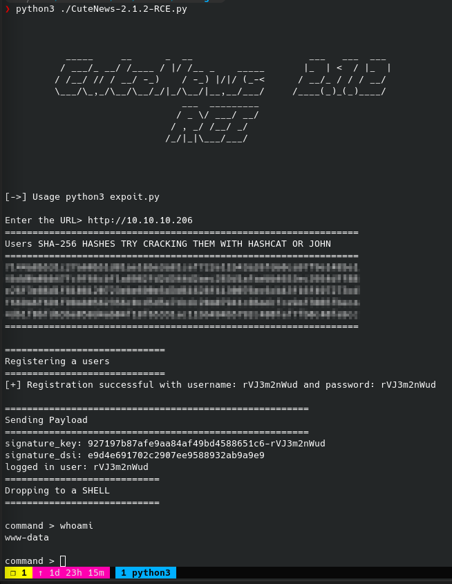
 
It dumped 5 hashes and dropped me to a www-data shell.  Much easier foothold than most Easy boxes I have done.

 
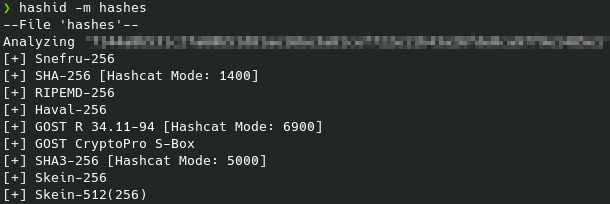
 
I ran hashid to get the hashcat mode.

 
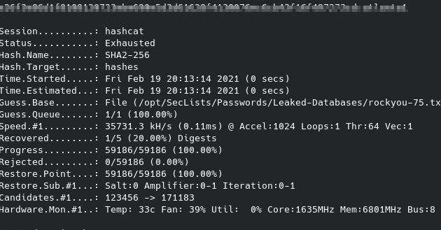
 
Basic abridged rockyou word-list with no hashcat rules cracked exactly one hash.  I tried other word-lists and rules, but only the single hash could be cracked.

 
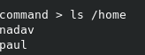
 
Back to the web-shell, enumerating users on the box.

 
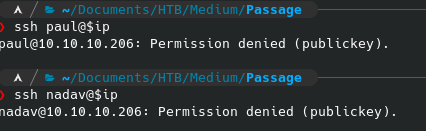
 
Only key authentication for both user accounts. Bummer.  Back to the Web-shell.

 
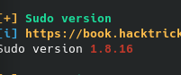
 
I could run the new sudo buffer overflow, Baron Samedit.  But that's definitely not the intended solution.  Let's keep that in our back pocket for root.

 
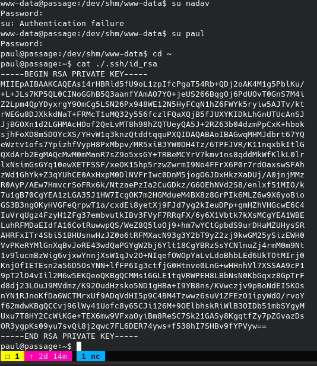
 
Checking credential reuse with su.  Got the Paul account and dumped the ssh key.

 
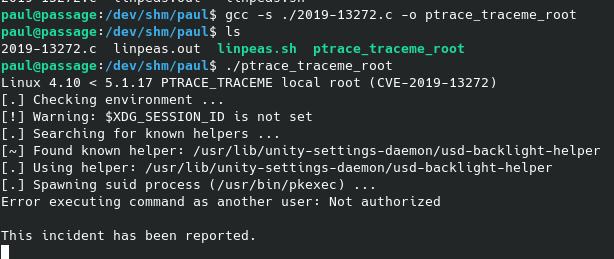
 
I tried a kernel exploit that looked promising, but no dice.  My enumeration is not coming up with anything interesting, and that sudo exploit is looking better and better.

 
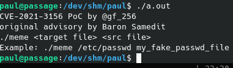
 
Unfortunately, the sudo version is actually not susceptible to the new buffer overflow...

 
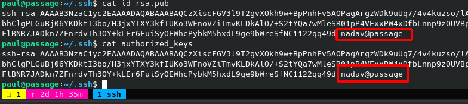
 
All right I am pretty annoyed that I missed this.  And also, why... who does this...

 
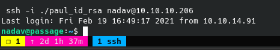
 
Seriously this is probably the dumbest privesc ever lol.  Now on to the REAL privesc.

 

 
The linpeas logo never gets old.

 
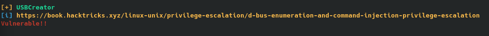
 
So nothing new in linpeas, I am going to check this.  I ignored it earlier because I assumed I needed nadav's sudo or adm group membership to privesc to root.  Realizing I don't have password to do anything with sudo, and not seeing anything of the bat in fail2ban logs (I really though this would be it...), I will attempt this usbcreator thing.

 
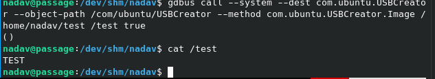
 
Okay this is going a bit over my head, but I know it's the right track because: 1. It works, and 2. the original blog post about the discovery of this vulnerability used the name 'nadav' in the poc.  

 

Basically what we can do now is copy any file to any location as root.  I think we know what to do from here.

 
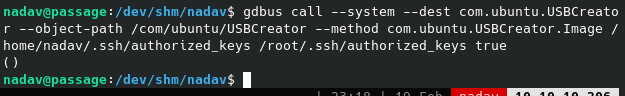
 

 
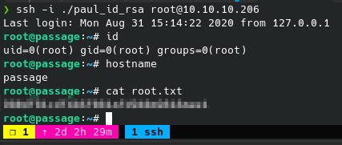
 
Whew!  What a box!
