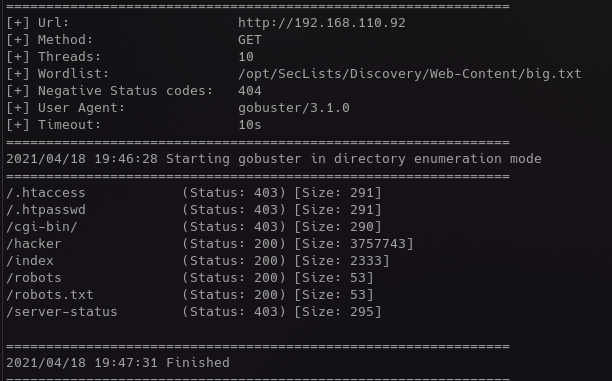

# CyberSploit1
[Vulnhub release](https://www.vulnhub.com/entry/cybersploit-1,506/)

## Description
```
THIS IS A MACHINE FOR COMPLETE BEGINNER , THERE ARE THREE FALGS AVAILABLE IN THIS VM.

FROM THIS VMs YOU WILL LEARN ABOUT ENCODER-DECODER & EXPLOIT-DB.
```
As you can see, the bar has been set pretty high...

## My Take
Easy box, but User is pretty poorly done.  Root was just 'okay'.  Underwhelming for my first PG box...


## Root it!

<br/>

<br/>
SSH and Apache running and unfiltered on the box.

<br/>

<br/>
Credentials in an HTML comment.

<br/>

<br/>
Some interesting finds from gobuster.  Trying to brute force with hydra at the same time with the found username and rockyou-35, it is not looking promising.

<br/>

<br/>
Found some interesting encoded text in `robots.txt`

<br/>

<br/>
So this part is dumb; the username we know, and the password is actually the base64 "flag".  I hope this is not indicative of the quality of these machines...

<br/>

<br/>
Hopefully privesc is more interesting.

<br/>

<br/>
Kernel exploits are okay, I could use the practice even if theres not much to them.

[Linux Kernel 3.13.0 < 3.19 (Ubuntu 12.04/14.04/14.10/15.04) - 'overlayfs' Local Privilege Escalation](https://www.exploit-db.com/exploits/37292)

<br/>

<br/>
Had to compile on the box, and not on my machine.  I need to get smarter on compilation flags and architectures and what not.

I won't show the root flag.  You get the point.
